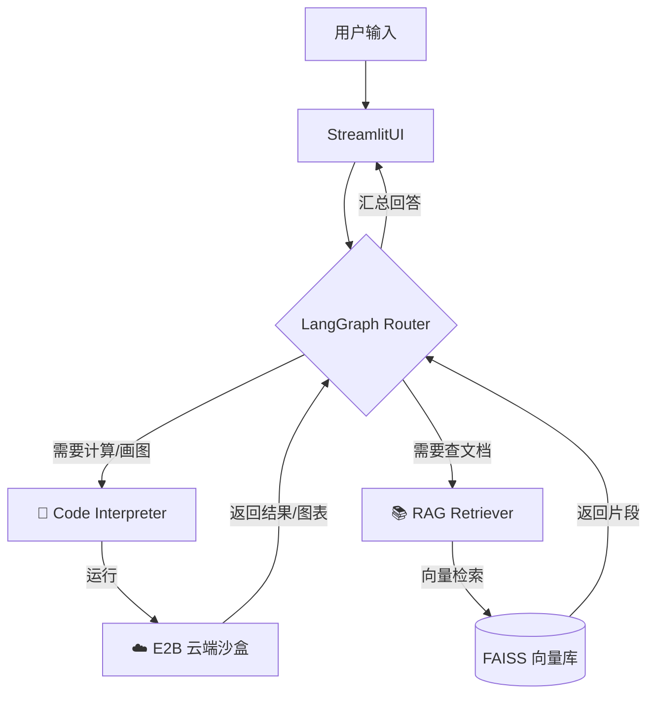

# 🤖 Data Insight Agent: 企业级智能数据分析平台


> 一个基于 **LangGraph** 双引擎架构（Code Interpreter + RAG）的智能数据分析助手。解决了 LLM 在数据计算中的幻觉问题，并利用 **E2B 云端沙盒** 保障了代码执行的安全性。

## 🌟 核心特性 (Key Features)

- **🧠 双脑协同架构**：
  - **左脑 (Code Interpreter)**：处理结构化数据（CSV/Excel），自动编写 Python 代码进行清洗、统计与可视化。
  - **右脑 (RAG)**：处理非结构化文档（PDF），基于向量检索回答业务政策与背景知识。
  
- **🛡️ 生产级安全隔离**：
  - 集成 **E2B 沙盒**，所有 AI 生成的代码均在云端隔离容器中运行，杜绝 RCE（远程代码执行）风险。
  
- **🔄 自我修正机制 (Self-Correction)**：
  - 基于图结构的错误循环机制，当代码报错时，Agent 会自动分析 Traceback 并重写代码，大幅提升执行成功率。

- **💾 持久化记忆**：
  - 利用 SQLite 实现多轮对话状态管理，支持会话切换与断点续传。

## 🏗️ 系统架构 (Architecture)



## 🚀 快速开始 (Quick Start)

### 1. 克隆项目
```bash
git clone [https://github.com/your-username/data-insight-agent.git](https://github.com/your-username/data-insight-agent.git)
cd data-insight-agent
```

### 2. 安装依赖
```bash
pip install -r requirements.txt
```

### 3. 配置环境变量 (可选)
你可以直接在 Web 界面侧边栏输入 Key，也可以创建 `.streamlit/secrets.toml` 文件预填：

```toml
[general]
DEEPSEEK_API_KEY = "sk-..."
E2B_API_KEY = "e2b_..."
OPENAI_API_KEY = "sk-..."
```

### 4. 运行应用
```bash
streamlit run app_v3.py
```


## 🛠️ 技术栈 (Tech Stack)

- **LLM**: DeepSeek V3 (Reasoning & Coding)
- **Orchestration**: LangChain / LangGraph (State Machine)
- **Sandbox**: E2B Code Interpreter (Security)
- **Frontend**: Streamlit
- **Vector DB**: FAISS
- **Data Engine**: Pandas, Matplotlib

## 📄 License

MIT License
