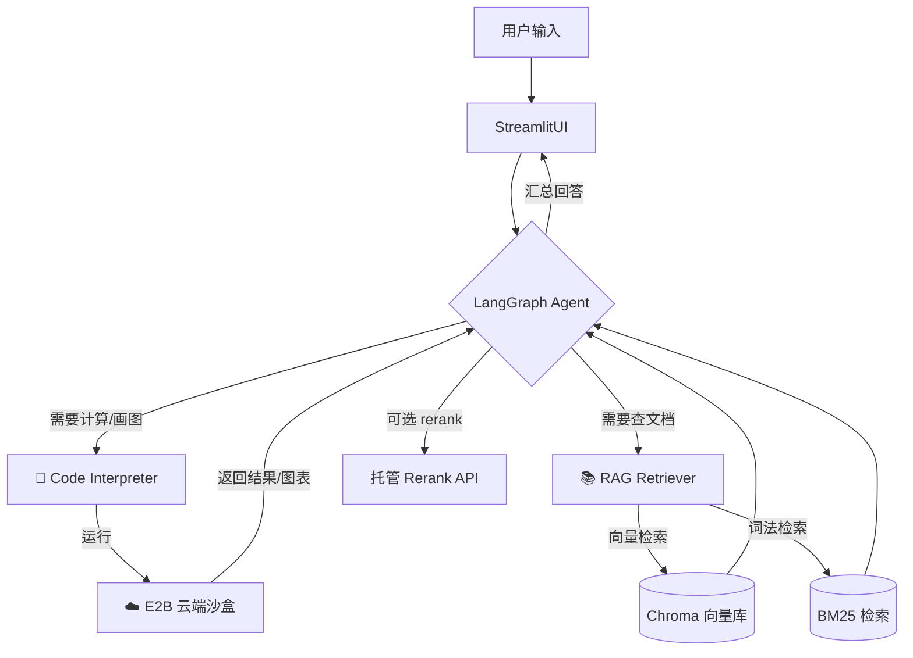

# 🤖 Data Insight Agent: 企业级智能数据分析平台


> 一个基于 **LangGraph** 的智能数据分析助手：用 **E2B 云端沙盒**安全执行 LLM 生成的 Python 代码，并结合 **RAG** 为企业文档/政策问答提供可检索上下文。

## 🌟 核心特性 (Key Features)

- **🧠 双脑协同架构**：
  - **左脑 (Code Interpreter)**：处理结构化数据（CSV/Excel），自动编写 Python 代码进行清洗、统计与可视化。
  - **右脑 (RAG)**：处理非结构化文档（PDF），基于向量检索回答业务政策与背景知识。
  
- **🛡️ 生产级安全隔离**：
  - 集成 **E2B 沙盒**，所有 AI 生成的代码均在云端隔离容器中运行，杜绝 RCE（远程代码执行）风险。
  
- **🔄 运行时错误反馈驱动修正**：
  - 当沙盒执行报错时，程序会把 `traceback/error` 原样返回给模型；模型可以在后续步骤中基于错误信息改写代码并再次执行。

- **💾 持久化记忆**：
  - 利用 SQLite（`memory.sqlite`）实现多轮对话状态管理，可通过 `thread_id` 切换会话并续接上下文。

## 🏗️ 系统架构 (Architecture)


```mermaid
graph TD
    User[用户输入] --> StreamlitUI
    StreamlitUI --> Agent{LangGraph Agent}
    
    Agent -- 需要计算/画图 --> PythonTool[🐍 Code Interpreter]
    PythonTool -- 运行 --> E2B[☁️ E2B 云端沙盒]
    E2B -- 返回结果/图表 --> Agent
    
    Agent -- 需要查文档 --> RAGTool[📚 RAG Retriever]
    RAGTool -- 向量检索 --> Chroma[(Chroma 向量库)]
    RAGTool -- 词法检索 --> BM25[(BM25 检索)]
    Chroma --> Agent
    BM25 --> Agent
    Agent -- 可选 rerank --> RerankAPI[托管 Rerank API]
    
    Agent -- 汇总回答 --> StreamlitUI
```
## 🚀 快速开始 (Quick Start)

1. 克隆项目
```bash
git clone [https://github.com/your-username/data-insight-agent.git](https://github.com/your-username/data-insight-agent.git)
cd data-insight-agent
```
2. 安装依赖
```bash
pip install -r requirements.txt
```
3. 启动应用
```bash
streamlit run app.py
```

## 🧰 使用方式

- 在左侧上传 `CSV/Excel`：触发 Code Interpreter，对数据进行统计/清洗/绘图。
- 在左侧上传 `PDF`：触发 RAG 索引构建（向量检索 + BM25），并在问题时检索片段作为上下文。
- （可选）开启 `Rerank`：使用托管 Rerank API 对候选片段进行精排（失败会回退到 RRF/检索排序）。

## 🛠️ 关键参数与限制

- 绘图必须保存为固定文件名：`result.png`（多次/并发请求时可能覆盖）。
- 绘图标题/坐标轴建议使用英文，避免 Linux 字体缺失导致乱码。
- “清空会话历史”只影响界面显示；对话持久化在 `memory.sqlite`，需要切换 `thread_id` 才能获得更干净的上下文。

## 🛠️ 技术栈 (Tech Stack)

- LLM：DeepSeek（通过 `deepseek-chat`）
- Orchestration：LangGraph（State Machine）
- Sandbox：E2B Code Interpreter（安全执行）
- Frontend：Streamlit
- RAG：Chroma 向量库 + BM25（可选混合检索 + RRF）+ 可选 rerank
- Data Engine：Pandas, Matplotlib

📄 License MIT
